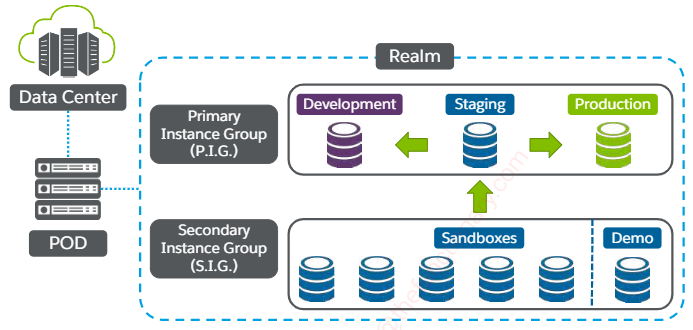

# Salesforce B2C

**It´s composed by:**
* Third-Party Integrations.
* Intelligence & Personalization.
* Order Managment.
* Product Managment.
* Customer Experience Managment.
* Order Processing & Fulfillment.
* Touch Ponts: Social, Kiosk, Web, Mobile, Tablet, Store & Contact Center.

## Instances
App infrastructure that includes: web servers, app servers & database servers.
### SandBox
Used by developers to create & update storefront code. One per developer.
### Development
Testing. CDN-Enabled & not scalable.
### Staging
Shared by many merchants to import & mantain storefront data as scheduled. System administrators import data & upload code to prepate it for testing. Only instance that can have both data & code replicated both to development & production.
### Production
Live, scalable storefront that is CDN-Enabled.

## Infrastructure


## StoreFront Reference Architecture (SFRA)
* Out of the box blueprint for site desgin, with fully functioning cart, checkout, homepage & detail page.
* Leverages JavaScript controllers development model, UX best practices, data driven design & Bootstrap mobile UI.
* Easily cutomized by retailers, system integrators & developers.

## Cartridge Stack


## Model View Controller (MVC)


## Business Manager
### Merchants
* Products & Catalogs.
* Content.
* Marketing Campaigns.
* Customers.
* Site Analysis.
* Site URLS.
* Site Preferences.
### Developers
* Deploy Code.
* Define Objects.
* Add Cartridges.
* Adjust OCPAI Setttings.
* Manage:
    * Code & Data Replication.
    * Code Versioning.
    * Site Developemt.
    * Data Import & Export.
    * Global Preferences.

## How to Access SFRA?
### Business Manager
* SFRA Core Codebase.
* All-In-One Codebase.
### GitHub
* SFRA Core Codebase.
* Plugin Cartridge.
* Link Cartridge(optional).
* Customization Cartridge(optional).

## StoreFront & Master Catalog
**Each site consists of:**
* One or more **Master Catalog** wich contains the actual products.
* Single **StoreFront Catalog(Site Catalog)** wich provides **Search & Navigation** with **Categories**.


## Cartridge
* Folder containing a set of resources.
* Provides specific StoreFront features or an external integration.
* Has specific subfolders for different types of resources-templates, scripts, forms & static content.

## Typical Cartridge Stack


## Cartridge Directory Structure


## Cartridge Path
Functionality will be implemented & executed from left to right in the cartridge path.

> To access the Cartridge Path:
> Administraion/Sites/Manage Sites/RefArch-Settings
**Considerations:**
* Plugin Cartridges are:
    * Developed against base cartridge but not against each other.
    * May obtain conflicting code. Ex: using same template / controller name.
* You can:
    * Use **plugin_cartridge_merge** from Github.
    * Or, use the all-in-one codebase from Business Manager.

## SFRA Modules
* Use **CommonJS** modules to share reusable functionality.
* Modules folder is a peer of cartridge folders.
* SFRA provides a **server** module.
> **CommonJS** is a specification (not a library).
> Defines the behavior or the exports variable as well as
> the **require** function.

## Cartridges Best Practices
* Never directly modify anything in base cartridges(app_storefront_base or modules).
* Use custom cartridges to separate functionality specific to a brand|locale, so you can reuse most of your cartridge stack for other sites.

## Controllers
* Server-side scripts that handle storefront requests.
* Manage the flow of data in your app & calls models that create **ViewModels** to process each request as a route & generate a response.
* Written in **JavaScript** & **B2C Commerce Script** & must conform to the **CommonJS** module standard.

## B2C Commerce Scriptt
* Server-side language based on JavaScript
* Access storefront site data, such as products, catalogs & prices.
* Used in controllers and ISML templates.
```javascript
server.get('MiniCart', server.middleware.include, function (req, res, next) {
    var BasketMgr = require('dw/order/BasketMgr');

    var currentBasket = BasketMgr.getCurrentOrNewBasket();
    var quantityTotal;

    res.render('/components/header/miniCart', { quantityTotal: quantityTotal });
    next();
});
```

## Controller Code Example
```javascript
'use strict'

var server = require('server');
server.get('Show', function (req, res, next) {
    res.render('/home/homepage');
    next();
});

module.exports = server.exports();
```
> Use **require** to load server module.
> *server.exports()* registers all functions
> in the controller that use *server.get*, *server.post*
> or *server.use* functions as routes.

## Server Module
Located in the SFRA global modules folder, it provides the routing functionality for controllers. EVERY controller requires this module.
```javascript
// server.js is in modules cartridge
var server = require('server');

server.get('Show', function(req, res, next) {
    res.json({ value: 'Hello World' });
    next();
});
module.exports = server.exports();
```
> First Parameter: Always the
> name of the route(URL endponit)
> Second Parameter: Usually the
> main function fot the endpoint.

## Types of Routes
* **server.get:** GET requests are tipically use to retrieve information. Parameters are included in the request´s query string.
* **server.post:** POST requests are intended for saving information. The data to save is sent in the request´s body.
* **server.use:** Responds to both GET & POST requests, as well the other http methods.(Rarely used).

## Add Middleware Functions
**Middleware Chaining:** Process of adding functions between first & last parameter, with functions taking 3 arguments: req, res & next.
* **req:** Stands for **request** module, references the Request Class. Use when you´re looking for input information.
    * *req.getPageMetaData*
    * *req.getFormData*
    * *req.querystring*
* **res:** Stands for **response** method, references Response Class. Use for outputting data back to the client.
    * *res.json*
    * *res.setViewData*
    * *res.render(templateName.data)*
    * *res.getViewData*
* **next:** Use to notify the server that you´re done with this middleware step & it can execute the next step in the chain.
> To test a controller just add the name of it
> at the end of the stortefront´s URL.

## Controller URL
zztr-**035**.sandbox.us01.dx.commercecloud.salesforce.com/on/demandware.store/Sites-**RefArch-Site**/**en_US**/**Search**-**Show**?**q=TV&lang=en_us**
* **035:** Number of your sandbox.
* **Sites-RefArch-Site:** ID of the site you´re currently viewing. For Business Manager, it´ll be Sites-Site.
* **en_US:** Locale you´re browsing.
* **Search:** Controller you´re executing.
* **Show:** Route you´re executing in the current controller.
* **q=TV&lang=en_us:** Query string.

## Passing Parameters
Renders the *hello.isml* template & passes a string message calles param1:
```javascript
res.render('hello', {param1: "Hello from ISML"});
```
*param1* is loaded on the *pdict* hashmap in the *hello.isml* template:
 ```javascript
${pdict.param1}
```